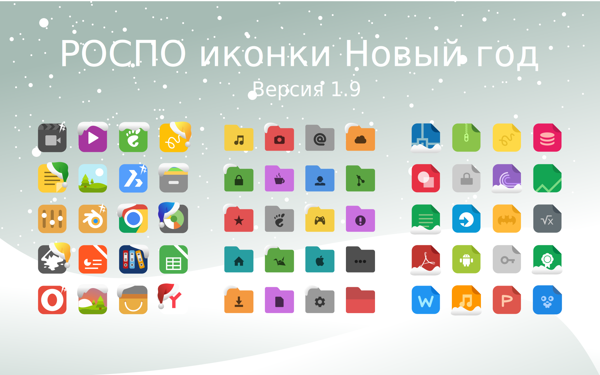

rospo-icon-theme
===============

РОСПО иконки для РОСЫ. Версия 1.9
За основы была взята замечательная тема Papirus https://store.kde.org/p/1166289/

## Изображение 

## Особенности

* Более 3000 иконок
* Подходит для разных окружений KDE4, KDE5 Plasma, Xfce, Gnome, LXQT, Mate и т.д.
* Для тёмных и светлых тем
* Новая новогодняя тема

## Установка

`git clone https://github.com/chistota/rospo-icon-theme.git /usr/share/icons/`

## Сообщество
РОСПО Дизайн-студия
https://vk.com/rospodesign
