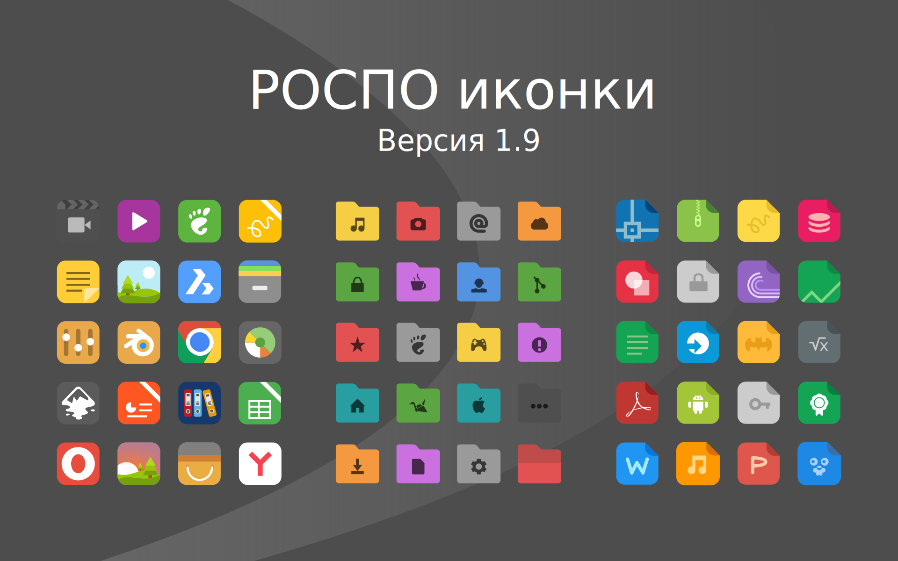

rospo-icon-theme
===============

* РОСПО иконки для РОСЫ. Версия 1.9.5
* ROSPO icons version 1.9.5

## Изображение / Image

## Изменения

* Добавлено несколько иконок меню 
* Приведена в порядок часть папок малкньких иконок
* Сделаны некоторые правки в index.desktop

## Change

* Added some menu icons 
* Given in the right part of the folder macnica icons
* Made some edits to index.desktop

## Особенности

* Более 3000 иконок
* Подходит для разных окружений KDE4, KDE5 Plasma, Xfce, Gnome, LXQT, Mate и т.д.
* Для тёмных и светлых тем
* Новая новогодняя тема

## Features

* More than 3000 icons
* Suitable for different environments KDE4, KDE5 Plasma, Xfce, Gnome, LXQT, Mate, etc.
* For dark and light themes
* New "New Year" theme

## Установка / Installation

`git clone https://github.com/chistota/rospo-icon-theme.git /usr/share/icons/`

## Сообщество / Community
* РОСПО Дизайн-студия
* ROSPO Design Studio
* https://vk.com/rospodesign

